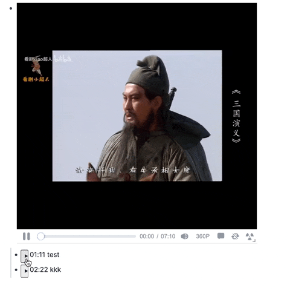
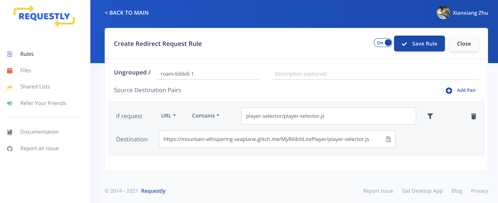

# Roam-Research-Bilibili-Timestamp

支持 iframe 方式嵌入的 Bilibili 播放器跳转

运行环境：

- 浏览器插件：Tampermonkey
- 浏览器插件：Requestly

## 安装

请先下载以上插件

以下步骤均基于 Google Chrome
### 插件：Requestly 相关配置

配置规则前需要注册该插件账户

- 配置规则1
  - URL contains: `player-selector/player-selector.js`
  - Destination: `https://mountain-whispering-seaplane.glitch.me/MyBilibiliLitePlayer/player-selector.js`
- 配置规则2
  - URL contains: `https://player.bilibili.com/main/html5/outer/liteplayer.min.js`
  - Destination: `https://mountain-whispering-seaplane.glitch.me/MyBilibiliLitePlayer/liteplayer.min.js`

### 插件：Tampermonkey 安装脚本

- 打开 Tampermonkey Dashboard - Utilities
- Install from URL: `https://raw.githubusercontent.com/LudwigWS/roam-research-bilibili-timestamp/main/roam_bilibili.js`

## 使用

`{{iframe: https://player.bilibili.com/player.html?bvid=<bvid>}}`

- 原视频地址（通过浏览器地址栏或者手机APP分享得到类似格式地址）：`https://www.bilibili.com/video/BV1ZK4y1N74w?from=search&seid=15522452478828207831`
- 转换一下：`https://player.bilibili.com/player.html?bvid=BV1ZK4y1N74w`
- 放入 Roam Research: `{{iframe: https://player.bilibili.com/player.html?bvid=BV1ZK4y1N74w}}`

以下格式会得到解析

- {{iframe: https://player.bilibili.com/player.html?bvid=BV1ZK4y1N74w}}
  - 01:00 note 1
  - 02:00 note 2

## 已知BUG

- [ ] 单击 iframe 重新加载视频的时候跳转按钮失效（有空再修[doge]）
## Thanks

- Roam YouTube timestamp controls (created by Ryan Muller <ryanmuller@google.com>)
